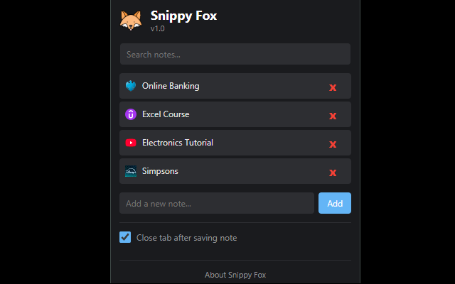
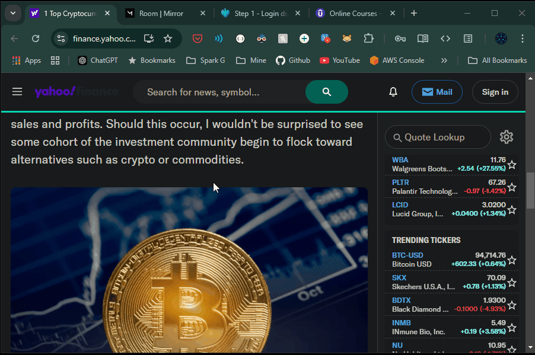

[//]: # (Constants)
[store-link]: https://chrome.google.com/webstore/detail/[ext-id]
[ext-id]: your-extension-id
[privacy-link]: https://github.com/muammar-yacoob/Snippy-Fox/blob/main/PRIVACY.md


# 🦊 Snippy Fox

> Save interesting bits from the web in a click!

<div align="center">



[Chrome Web Store][store-link] • [Privacy Policy][privacy-link] • [Report Bug](issues)

</div>

## ✨ What it does
- Right-click to save snippets from any webpage
- Auto-saves URL and favicon for context
- Quick search & dark mode UI
- Optional auto-close tabs after saving



## 🚀 Quick Start
```bash
git clone https://github.com/muammar-yacoob/Snippy-Fox.git
# Load in Chrome: Extensions -> Developer mode -> Load unpacked
```

Found this useful? Give it a ⭐ and feel free to share ideas or contribute! Released under MIT license.

[store-badge]: https://img.shields.io/chrome-web-store/v/[ext-id]?label=Chrome%20Web%20Store